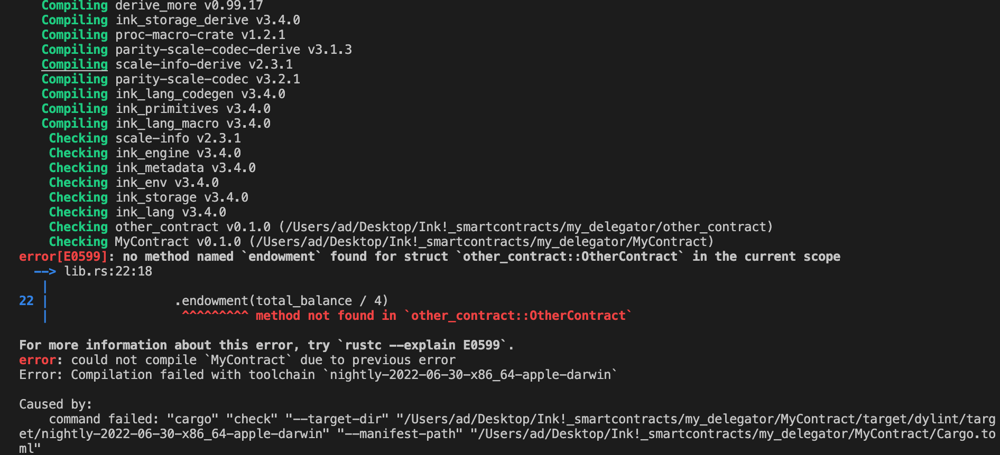

# **ink! Cross Contract Calling**

This is an attempt to follow the tutorial from https://use.ink/basics/cross-contract-calling/
 
It contains other_contract which has a get_value
 
and MyContract which tries to instantiate other_contract and then store it so it can call the get_value

 
The other_contract  builds fine via $ cargo +nightly contract build
 
 
The MyContract  fails to build 
 

 
cargo --version
 
cargo 1.65.0 (4bc8f24d3 2022-10-20)
 
 
cargo contract --version
 
cargo-contract 1.5.1-unknown-x86_64-apple-darwin
 
